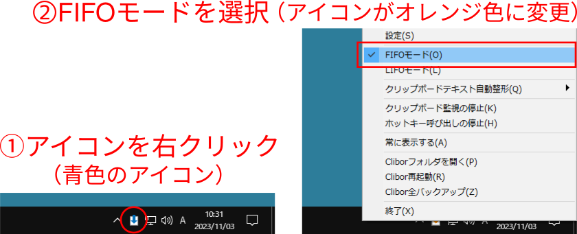

# copyline-prototype

## 概要
+ テキストボックスに入力したテキストの内容を
  1行ずつ正規表現で切り出してから
  クリップボードにコピーするためのサイトです
+ markdown 形式などで作成した箇条書き部分から
  必要な部分をコピーする場合に有用です
+ 後述する
  **Clibor（クリップボード履歴フリーソフト）と併用することを前提としています**

## インストール方法
+ インストールの必要はありません
+ [このページ](https://toshi-ara.github.io/copyline-prototype/)
  にアクセスして下さい


## 使い方
1. 文章を markdown 形式で箇条書きして下さい
    + markdown 形式でない場合でも使用可能です
1. 必要な部分をコピーしてテキストボックスに貼り付けて下さい
1. "コピー"ボタンを押して下さい
1. **箇条書きのための記号や正答を示す記号を除いた部分**
   がクリップボードにコピーされます

## 使用例
以下の例では
`問題文`、`選択肢1`、`選択肢2` がクリップボードにコピーされます

### 記号
`-`, `+`, `*` を使用できます。

```
- 問題文
    - 選択肢1 ##
    - 選択肢2
```

```
+ 問題文
    + 選択肢1 ##
    + 選択肢2
```

```
* 問題文
    * 選択肢1 ##
    * 選択肢2
```
### 英数字
以下のいずれの形式でも動作します。

```
1. 問題文
     a. 選択肢1 ##
     b. 選択肢2
```

```
1) 問題文
     a) 選択肢1 ##
     b) 選択肢2
```

```
(1) 問題文
    (a) 選択肢1 ##
    (b) 選択肢2
```

### 正答・誤答の指定
問題を作成するときに正答や誤答を追加したい場合があります。

この場合には、コピーしたい文字列（選択肢など）の後に
半角スペースあるいはタブを挟んで
`##`（`#`を1個以上連続させたもの）,
`○`, `×`を記載することができます。
この部分はクリップボードにコピーされません。

ただし`○`および`×`は機種依存文字を使う場合があるため非推奨です。

```
- 問題文
    - 選択肢1 ##
    - 選択肢2 ○
    - 選択肢3 ×
```

### 無視される行
空行および `#` で始まる行は無視されます
(markdown では `#` で始まる行は見出しとして扱われるため)


## Clibor（クリップボード履歴フリーソフト）との併用（超推奨）

`FIFO` (First In, First Out) とは「先入れ先出し」のことです。
[Clibor][clibor_URL] というクリップボードの機能を拡張する
フリーソフトウェアを使用すると
`FIFO` を行うことができます
（[Cliborの設定][clibor_FIDO_LIFO]で値 `FIFO` を選択します）。
この機能を使用することで、
先にまとめてコピーしておいてから順番に貼り付けることができます

この Clibor と今回の拡張機能を併用することで、
markdown 形式の箇条書き部分から必要な内容をまとめてコピーした後に
web の入力項目などに順番に貼り付けることが容易にできます

[clibor_URL]:https://chigusa-web.com/
[clibor_FIDO_LIFO]: https://chigusa-web.com/clibor/fifo-lifo/

### (ToDo) Clibor の設定
+ FIFOモード
    + アイコンを右クリックするとメニュー画面が出るため
      FIFOモードを選択する


+ 設定を変更することで起動時からFIFOモードにすることが可能です（推奨）


## 既知の問題点
+ コピー中にカーソルを他のウィンドウに移動させると
  コピーが停止します（これは仕様です）。
+ "クリップボードにコピーしたテキストや画像へのアクセス"
  を許可する旨のメッセージが出た場合には許可して下さい


## Release Notes
### 0.0.1
最初のリリース

